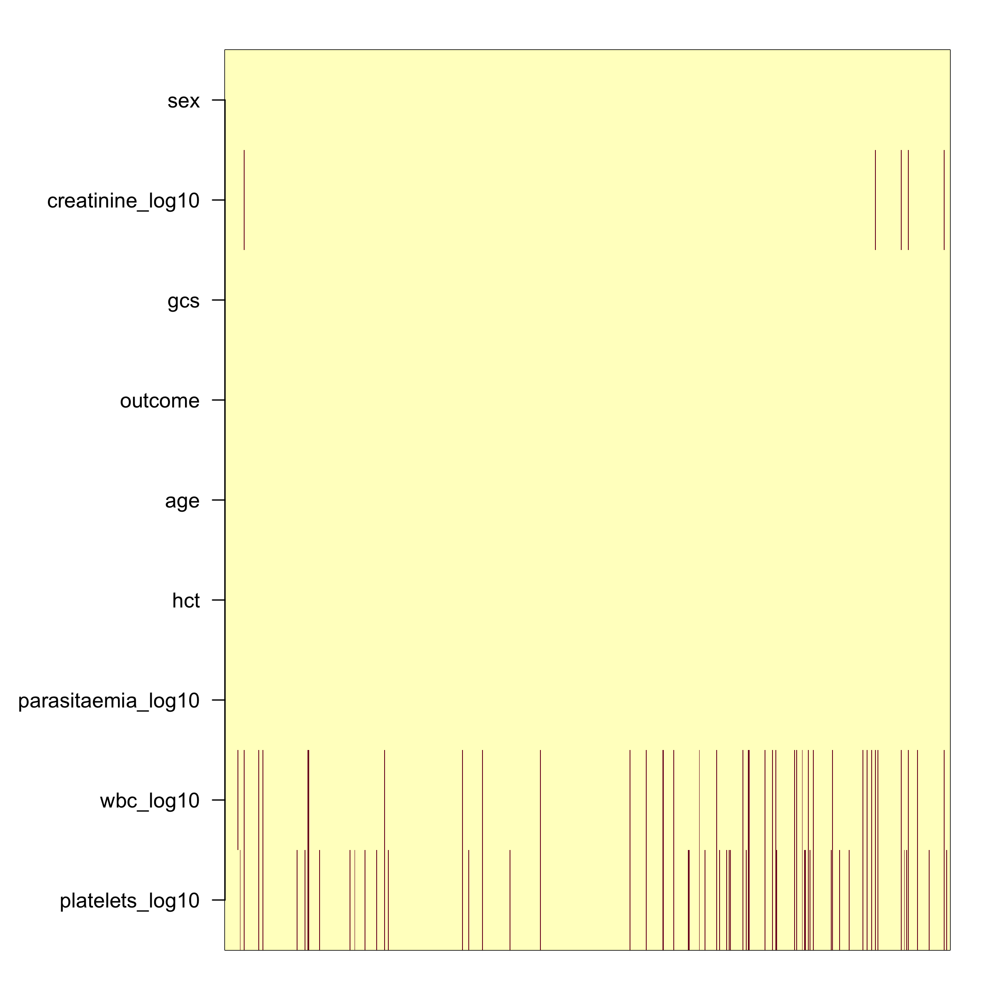
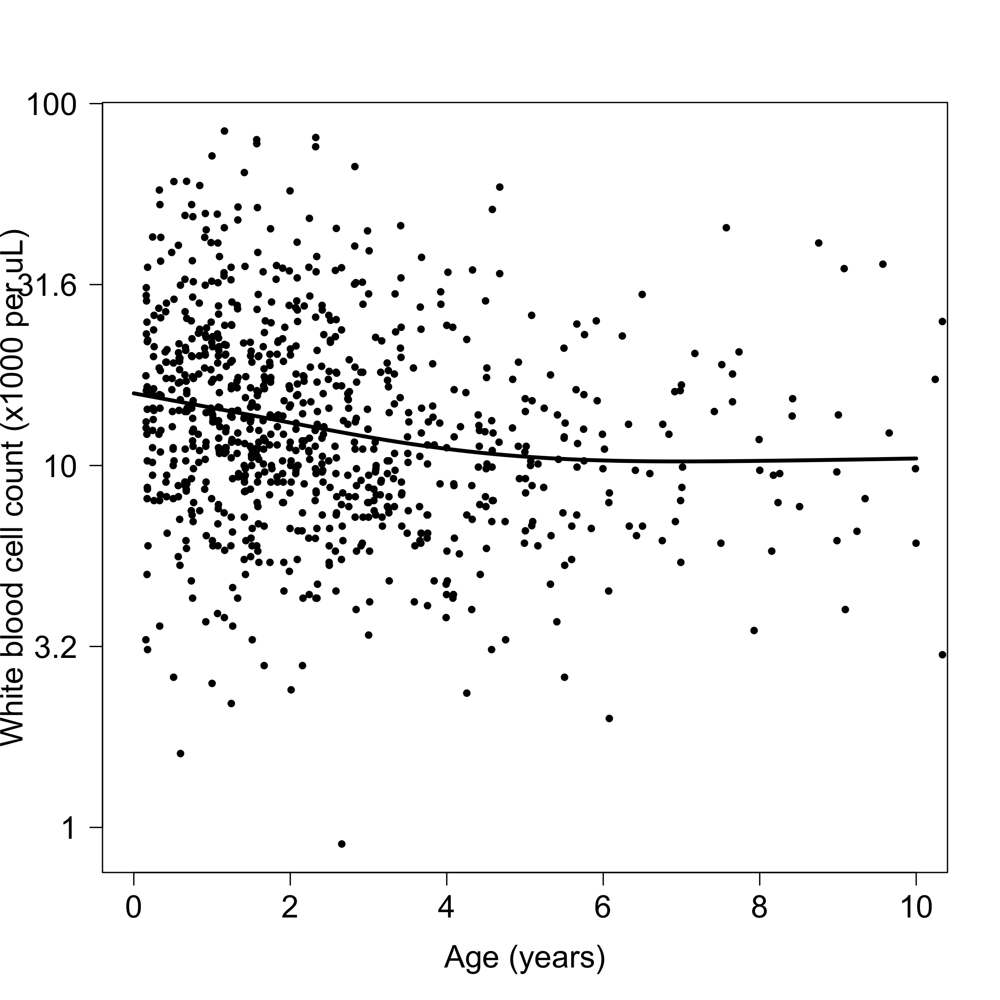
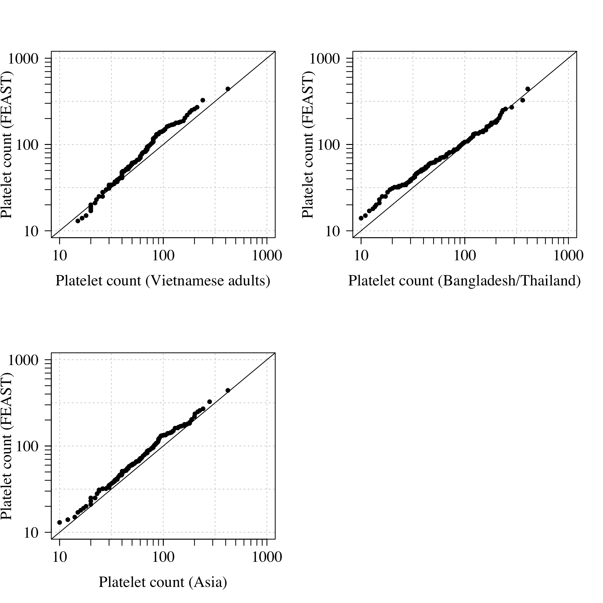
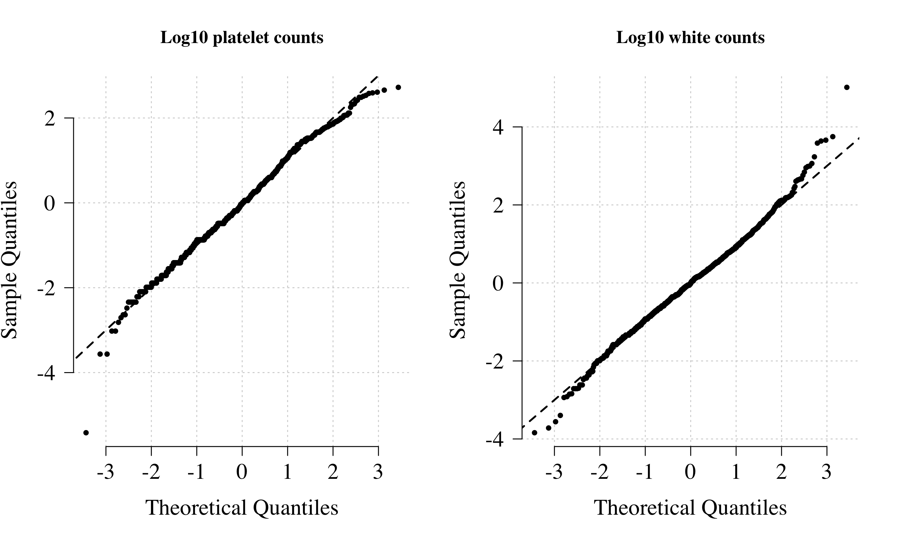

## Overview

This script puts together clinical data from multiple studies in order to estimate probabilities that Kenyan children enrolled in a large observational cohort had severe malaria.

This script can only be run with access to original datasets - need to contact XXXXX.

Data used to build the reference model of severe malaria:

* AQ Vietnam (platelets and white counts): adults
* AAV Vietnam (platelets and white counts): adults
* MORU database (white counts and platelets): kids
* FEAST (white counts, platelets, Hrp2): kids


## Kenyan dataset

Load data

```r
load('../RData/kemri_case_data.RData')
load('../RData/kemri_control_data.RData')

kemri_case_data$sickle_trait = as.numeric(kemri_case_data$sickle==2)
kemri_control_data$sickle_trait = as.numeric(kemri_control_data$sickle==2)
writeLines('Distribution of the number of WT alleles (A) at rs_334 in the severe malaria cases:')
```

```
## Distribution of the number of WT alleles (A) at rs_334 in the severe malaria cases:
```

```r
table(kemri_case_data$sickle-1, useNA = 'ifany')
```

```
## 
##    0    1    2 <NA> 
## 2145   57   11    7
```

```r
writeLines('Distribution of the number of WT alleles (A) at rs_334 in the population controls:')
```

```
## Distribution of the number of WT alleles (A) at rs_334 in the population controls:
```

```r
table(kemri_control_data$sickle-1, useNA = 'ifany')
```

```
## 
##    0    1    2 
## 3313  594   33
```


Do imputation for missing variables

```r
K_imputes = 10

dat = kemri_case_data

dat$baseexc[dat$baseexc > 30]= NA
dat$BD = -dat$baseexc

dat$log10_platelets = log10(dat$platelet)
dat$log10_wbc = log10(dat$wbc)
dat$log10_creatinine = log10(dat$creat)
dat$log10_creatinine[is.infinite(dat$log10_creatinine)] = NA

dat = dat[, -which(colnames(dat)=='baseexc')]
vars_interest = colnames(dat)
writeLines('All available variables:')
```

```
## All available variables:
```

```r
print(colnames(dat))
```

```
##  [1] "sample_code"            "pat_id"                 "source_code"           
##  [4] "ethnic"                 "agemths"                "ageyr"                 
##  [7] "sex"                    "died"                   "muac"                  
## [10] "height"                 "weight"                 "bpd"                   
## [13] "bps"                    "pul_hrate"              "crefill"               
## [16] "tempaxil"               "oxysat"                 "prostration"           
## [19] "severe_malaria_anaemia" "cerebral_malaria"       "respiratory_distress"  
## [22] "parasite_gn"            "hb"                     "rbc"                   
## [25] "hct"                    "mcv"                    "platelet"              
## [28] "na"                     "k"                      "creat"                 
## [31] "glucose"                "hco3"                   "g6pd_202"              
## [34] "g6pd_376"               "thal"                   "sickle"                
## [37] "wbc"                    "bcstot"                 "resp_rate"             
## [40] "bcs_verbal"             "bcs_motor"              "bcs_eyes"              
## [43] "convulsions"            "bcs_total"              "IID"                   
## [46] "bloodculture_pos"       "bacteria"               "case_control"          
## [49] "log_parasites"          "sickle_trait"           "BD"                    
## [52] "log10_platelets"        "log10_wbc"              "log10_creatinine"
```

```r
vars_interest = vars_interest[!vars_interest%in% 
                                c('ageyr','IID','case_control','thal',
                                  'bacteria',"sample_code",
                                  'sickle','g6pd_202','g6pd_376',
                                  "pat_id","source_code","parasite_gn",
                                  'bcs_total', 'bcs_eyes','bcs_motor',
                                  'bcs_verbal', 'platelet', 'wbc','creat')]

Missing_data = is.na(dat[,vars_interest])
par(las=1, mar=c(4,9,2,2))
image(x = 1:nrow(dat), y = 1:length(vars_interest), 
      Missing_data, yaxt='n',ylab='',xaxt='n', xlab='')
axis(2, at = 1:length(vars_interest), 
     labels = tolower(vars_interest),cex=.7)
```

<!-- -->

```r
writeLines(sprintf('There is clinical data on %s individuals', nrow(dat)))
```

```
## There is clinical data on 2220 individuals
```

```r
apply(kemri_case_data, 2, function(x) mean(is.na(x)))
```

```
##            sample_code                 pat_id            source_code 
##            0.000000000            0.000000000            0.000000000 
##                 ethnic                agemths                  ageyr 
##            0.000000000            0.001351351            0.001351351 
##                    sex                   died                   muac 
##            0.000000000            0.005855856            0.274324324 
##                 height                 weight                    bpd 
##            0.259909910            0.013963964            0.530180180 
##                    bps              pul_hrate                crefill 
##            0.501801802            0.225225225            0.164864865 
##               tempaxil                 oxysat            prostration 
##            0.050450450            0.155855856            0.019819820 
## severe_malaria_anaemia       cerebral_malaria   respiratory_distress 
##            0.000000000            0.070270270            0.029729730 
##            parasite_gn                     hb                    rbc 
##            0.016216216            0.000000000            0.044594595 
##                    hct                    mcv               platelet 
##            0.050000000            0.046396396            0.177927928 
##                     na                      k                  creat 
##            0.150000000            0.150450450            0.232432432 
##                glucose                   hco3                baseexc 
##            0.268468468            0.245945946            0.222972973 
##               g6pd_202               g6pd_376                   thal 
##            0.000000000            0.005405405            0.045495495 
##                 sickle                    wbc                 bcstot 
##            0.003153153            0.002252252            0.070270270 
##              resp_rate             bcs_verbal              bcs_motor 
##            0.180630631            0.377027027            0.377027027 
##               bcs_eyes            convulsions              bcs_total 
##            0.377027027            0.558108108            0.377927928 
##                    IID       bloodculture_pos               bacteria 
##            0.025225225            0.000000000            0.964864865 
##           case_control          log_parasites           sickle_trait 
##            0.000000000            0.016216216            0.003153153
```

```r
# redo this with platelets and wbc on log scale
if(RE_RUN_IMPUTATION){
  set.seed(8758768)
  registerDoParallel(cores = 6)
  
  imputed_data_KEMRI = list()
  my_dat = dat[,vars_interest]
  discrete_vars = c('sex','ethnic','died','prostration','cerebral_malaria',
                    'respiratory_distress','bloodculture_pos','severe_malaria_anaemia')
  for(cc in discrete_vars){
    my_dat[,cc] = as.factor(my_dat[,cc])
  }
  for(k in 1:K_imputes){
    out_impute = missForest(xmis = my_dat, variablewise = T, 
                            ntree = 200,
                            decreasing = T,verbose = T, 
                            parallelize = 'forests')
    out_impute$ximp$hypo_glycaemic = out_impute$ximp$glucose<2.2
    imputed_data_KEMRI[[k]] = out_impute$ximp
  }
  save(imputed_data_KEMRI, file = '../RData/Imputed_Datasets_KEMRI.RData')
} else {
  load('../RData/Imputed_Datasets_KEMRI.RData')
}
```


## Reference model datasets


AQ study - impute missing data

```r
# Load the AQ Vietnam data
aq_dat = readstata13::read.dta13('~/Dropbox/Datasets/AQ study/Vietnam AQ.DTA')
aav_dat = read.csv('~/Dropbox/Datasets/AllMalariaDataBackUp/AAV_Vietnam/AAV.csv')
aav_dat[aav_dat==999999] = NA
aq_dat_training = data.frame(platelets_log10 = log10(aq_dat$admplat/10^3),
                             wbc_log10 = log10(aq_dat$admwbc/10^3),
                             parasitaemia_log10 = log10(aq_dat$admpct),
                             hct = aq_dat$admhct,
                             age = aq_dat$age,
                             outcome = aq_dat$outcome,
                             gcs = aq_dat$admgcs,
                             creatinine_log10 = log10(aq_dat$admcrea),
                             sex = aq_dat$sex)
aav_dat_training = data.frame(platelets_log10 = log10(aav_dat$admplt/10^3),
                              wbc_log10 = log10(aav_dat$admwbc/10^3),
                              parasitaemia_log10 = log10(aav_dat$admparasitemia),
                              hct = aav_dat$initialhct,
                              age = aav_dat$age,
                              outcome = aav_dat$mortalityoutcome,
                              gcs = aav_dat$gcstotal,
                              creatinine_log10 = log10(aav_dat$admcrea),
                              sex = aav_dat$sex)
Vietnam_training = rbind(aq_dat_training, aav_dat_training)

apply(Vietnam_training, 2, function(x) round(100*mean(is.na(x)),1))
```

```
##    platelets_log10          wbc_log10 parasitaemia_log10                hct 
##                7.2                4.1                0.0                0.0 
##                age            outcome                gcs   creatinine_log10 
##                0.0                0.0                0.0                0.5 
##                sex 
##                0.0
```

```r
par(las=1, mar = c(2,9,2,2))
image(x = 1:nrow(Vietnam_training), 
      y = 1:ncol(Vietnam_training), is.na(Vietnam_training),
      yaxt='n',ylab='',xaxt='n', xlab='')
axis(2, at = 1:ncol(Vietnam_training), labels = tolower(colnames(Vietnam_training)),cex=.7)
```

<!-- -->

```r
if(RE_RUN_IMPUTATION){
  set.seed(8758768)
  registerDoParallel(cores = 6)
  
  imputed_data_Viet = list()
  my_dat = Vietnam_training
  discrete_vars = c('sex','outcome')
  for(cc in discrete_vars){
    my_dat[,cc] = as.factor(my_dat[,cc])
  }
  for(k in 1:K_imputes){
    out_impute = missForest(xmis = my_dat, variablewise = T, 
                            ntree = 200,
                            decreasing = T,verbose = T, 
                            parallelize = 'forests')
    imputed_data_Viet[[k]] = out_impute$ximp
  }
  save(imputed_data_Viet, file = '../RData/Imputed_Datasets_Vietnam.RData')
} else {
  load('../RData/Imputed_Datasets_Vietnam.RData')
}

# make an imputed dataset just for platelets and white counts
imputed_Vietam_minimal = list()
for(k in 1:K_imputes){
  imputed_Vietam_minimal[[k]] = 
    imputed_data_Viet[[k]][, c('platelets_log10','wbc_log10','age')]
}
save(imputed_Vietam_minimal, file = 'Inputs/imputed_Vietam_minimal.RData')
writeLines(sprintf('We include a total of %s adults from Vietnam',nrow(Vietnam_training)))
```

```
## We include a total of 930 adults from Vietnam
```


MORU core malaria (severe patients only)

```r
# Core Malaria - MORU: children with severe malaria
# prepared using file extract_data.R in the hrp2 folder
load(file = '../RData/Core_malaria_hrp2_platelets.RData')
# filter out one super low platelet count (probably data entry mistake)
dat_core = core_data[core_data$platelets>1, ]
dat_core = core_data[core_data$platelets<450, ]

print(table(dat_core$country))
```

```
## 
## Bangladesh   Thailand 
##        508        145
```

```r
hist(dat_core$age, breaks = seq(0,80,by=5))
```

<!-- -->

```r
writeLines(sprintf('We include a total of %s patients from the Bangladesh and Thailand',nrow(dat_core)))
```

```
## We include a total of 653 patients from the Bangladesh and Thailand
```


FEAST

```r
load(file = '../RData/feast_platelet_white_count_data.RData')
# select the patients with high HRP2 and parasite counts as training data for the reference model
ind_feast_training = !is.na(dat_feast$platelets) & 
  !is.na(dat_feast$white_count) & 
  !is.na(dat_feast$hrp2) & 
  !is.na(dat_feast$parasitaemia) & 
  dat_feast$hrp2 > 1000 & dat_feast$parasitaemia > 1000 
writeLines(sprintf('The diagnostic model training data includes a total of %s patients from the FEAST study',
                   sum(ind_feast_training)))
```

```
## The diagnostic model training data includes a total of 121 patients from the FEAST study
```

```r
ind_platelet_hrp2 = !is.na(dat_feast$platelets) &
  !is.na(dat_feast$hrp2)
xx = dat_feast[ind_platelet_hrp2, c('platelets','hrp2','parasitaemia')]
write.csv(xx, file = 'Inputs/FEAST_platelets_hrp2.csv',
          row.names = F)
writeLines(sprintf('We use a total of %s patients from the FEAST study to show the relationship between PfHRP2 and platelet counts',
                   sum(ind_platelet_hrp2)))
```

```
## We use a total of 567 patients from the FEAST study to show the relationship between PfHRP2 and platelet counts
```


We use the data from FEAST to estimate the age-related trend in white counts

```r
# Age model of white counts
wbc_age_model = mgcv::gam(formula = log10_wbc ~ s(age), 
                          data = data.frame(age=dat_feast$age,
                                            log10_wbc=log10(dat_feast$white_count)))
summary(wbc_age_model)
```

```
## 
## Family: gaussian 
## Link function: identity 
## 
## Formula:
## log10_wbc ~ s(age)
## 
## Parametric coefficients:
##             Estimate Std. Error t value Pr(>|t|)    
## (Intercept) 1.108483   0.009394     118   <2e-16 ***
## ---
## Signif. codes:  0 '***' 0.001 '**' 0.01 '*' 0.05 '.' 0.1 ' ' 1
## 
## Approximate significance of smooth terms:
##          edf Ref.df     F p-value    
## s(age) 2.321  2.908 12.55  <2e-16 ***
## ---
## Signif. codes:  0 '***' 0.001 '**' 0.01 '*' 0.05 '.' 0.1 ' ' 1
## 
## R-sq.(adj) =  0.041   Deviance explained = 4.36%
## GCV = 0.076018  Scale est. = 0.075724  n = 858
```

```r
# save model for reproducibility
save(wbc_age_model, file = 'Inputs/wbc_age_model')

par(las=1, cex.lab=1.5, cex.axis=1.5)
plot((0:120)/12, predict(wbc_age_model, newdata=data.frame(age=0:120)),
     type='l',lwd=3, xlab='Age (years)', ylab ='White blood cell count (x1000 per uL)',
     yaxt='n', ylim = range(log10(dat_feast$white_count),na.rm = T))
axis(2, at = seq(0,2, by=0.5), labels = round(10^seq(0,2, by=0.5),1))
points(jitter(dat_feast$age/12), log10(dat_feast$white_count), pch=20)
```

<!-- -->

```r
# estimate the expected baseline white count in severe disease in children older than 60 months
baseline_log10_wbc = mean(log10(dat_feast$white_count[dat_feast$age>60]), 
                          na.rm = T)
dat_feast$wbc_log10 = log10(dat_feast$white_count)

# calculate an age-corrected white count for FEAST children
dat_feast$wbc_log10_corrected = dat_feast$wbc_log10

ind = dat_feast$age<60 & !is.na(dat_feast$white_count)
dat_feast$wbc_log10_corrected[ind] = 
  dat_feast$wbc_log10_corrected[ind]-
  (predict(wbc_age_model, 
           newdata=data.frame(age=dat_feast$age[ind]))-baseline_log10_wbc)

dat_feast_training = 
  data.frame(platelets_log10 = log10(dat_feast$platelets)[which(ind_feast_training)],
             wbc_log10 = dat_feast$wbc_log10[which(ind_feast_training)],
             wbc_log10_corrected = dat_feast$wbc_log10_corrected[which(ind_feast_training)])

# calculate an age-corrected white count for Core Malaria children
ind = !is.na(dat_core$age)&dat_core$age<5
sum(ind)
```

```
## [1] 5
```

```r
dat_core$log10_wbc = log10(dat_core$wbc)
dat_core$platelets_log10 = log10(dat_core$platelets)
dat_core$log10_wbc_corrected = log10(dat_core$wbc)
dat_core$log10_wbc_corrected[ind] = dat_core$log10_wbc[ind]-
  (predict(wbc_age_model, newdata=data.frame(age=dat_core$age[ind]*12))-baseline_log10_wbc)

# calculate an age-corrected white count for Kenyan children
ind = !is.na(kemri_case_data$agemths) & kemri_case_data$agemths<60
# extract an imputed wbc set
kemri_case_data$log10_wbc_imputed = imputed_data_KEMRI[[1]]$log10_wbc
kemri_case_data$log10_platelet_imputed = imputed_data_KEMRI[[1]]$log10_platelet
kemri_case_data$log10_wbc_imputed_corrected = kemri_case_data$log10_wbc_imputed
kemri_case_data$log10_wbc_imputed_corrected[ind] = kemri_case_data$log10_wbc_imputed[ind]-
  (predict(wbc_age_model, newdata=data.frame(age=kemri_case_data$agemths[ind]))-baseline_log10_wbc)
```

## Compare platelet counts and white counts across datasets

QQ plots comparing studies

```r
par(mfrow=c(2,2), las= 1, family='serif', cex.lab=1.5, cex.axis=1.5)
qqplot(imputed_Vietam_minimal[[1]]$wbc_log10, # no crrection needed s all adults
       dat_feast_training$wbc_log10_corrected, 
       xlim=c(0,2), ylim=c(0,2),panel.first=grid(),
       xlab='White count (Vietnamese adults)',
       ylab='White count (FEAST)', xaxt='n',yaxt='n',pch=16)
axis(side = 1, at = 0:2,  labels = 10^(0:2))
axis(side = 1, at = log10(c(seq(1,10,by=1), seq(10,100,by=10))), 
     tick = T, labels = F)
axis(side = 2, at = 0:2,  labels = 10^(0:2))
axis(side = 2, at = log10(c(seq(1,10,by=1), seq(10,100,by=10))), 
     tick = T, labels = F)
lines(0:5, 0:5)


qqplot(dat_core$log10_wbc_corrected, 
       dat_feast_training$wbc_log10_corrected, 
       xlab='White count (Bangladesh/Thailand)',
       xlim=c(0,2), ylim=c(0,2),panel.first=grid(),
       ylab='White count (FEAST)', xaxt='n',yaxt='n',pch=16)
axis(side = 1, at = 0:2,  labels = 10^(0:2))
axis(side = 1, at = log10(c(seq(1,10,by=1), seq(10,100,by=10))), 
     tick = T, labels = F)
axis(side = 2, at = 0:2,  labels = 10^(0:2))
axis(side = 2, at = log10(c(seq(1,10,by=1), seq(10,100,by=10))), 
     tick = T, labels = F)
lines(0:5, 0:5)


qqplot(c(dat_core$log10_wbc_corrected,imputed_data_Viet[[1]]$wbc_log10), 
       dat_feast_training$wbc_log10_corrected, 
       xlab='White count (Asia)',
       xlim=c(0,2), ylim=c(0,2),panel.first=grid(),
       ylab='White count (FEAST)', xaxt='n',yaxt='n',pch=16)
axis(side = 1, at = 0:2,  labels = 10^(0:2))
axis(side = 1, at = log10(c(seq(1,10,by=1), seq(10,100,by=10))), 
     tick = T, labels = F)
axis(side = 2, at = 0:2,  labels = 10^(0:2))
axis(side = 2, at = log10(c(seq(1,10,by=1), seq(10,100,by=10))), 
     tick = T, labels = F)
lines(0:5, 0:5)
```

<!-- -->


```r
#************* Platelets ***************
par(mfrow=c(2,2), las= 1, family='serif', cex.lab=1.5, cex.axis=1.5)

qqplot(imputed_Vietam_minimal[[1]]$platelets_log10, 
       dat_feast_training$platelets_log10, 
       xlab='Platelet count (Vietnamese adults)',
       panel.first=grid(),
       xlim = c(1,3), ylim=c(1,3),
       ylab='Platelet count (FEAST)', pch=16, xaxt='n',yaxt='n')
axis(side = 1, at = 1:3, labels = 10^(1:3))
axis(side = 1, at = log10(c(seq(10,100,by=10), seq(100,1000,by=100))), 
     tick = T, labels = F)
axis(side = 2, at = 1:3, labels = 10^(1:3))
axis(side = 2, at = log10(c(seq(10,100,by=10), seq(100,1000,by=100))), 
     tick = T, labels = F)
lines(0:5, 0:5)

qqplot(log10(dat_core$platelets), 
       dat_feast_training$platelets_log10, 
       panel.first=grid(),
       xlim = c(1,3), ylim=c(1,3),
       xlab='Platelet count (Bangladesh/Thailand)',
       ylab='Platelet count (FEAST)', pch=16, xaxt='n',yaxt='n')
axis(side = 1, at = 1:3, labels = 10^(1:3))
axis(side = 1, at = log10(c(seq(10,100,by=10), seq(100,1000,by=100))), 
     tick = T, labels = F)
axis(side = 2, at = 1:3, labels = 10^(1:3))
axis(side = 2, at = log10(c(seq(10,100,by=10), seq(100,1000,by=100))), 
     tick = T, labels = F)
lines(0:5, 0:5)


qqplot(c(log10(dat_core$platelets), imputed_Vietam_minimal[[1]]$platelets_log10),
       dat_feast_training$platelets_log10, 
       xlim = c(1,3), ylim=c(1,3),
       panel.first=grid(),
       xlab='Platelet count (Asia)',
       ylab='Platelet count (FEAST)', pch=16, xaxt='n',yaxt='n')
axis(side = 1, at = 1:3, labels = 10^(1:3))
axis(side = 1, at = log10(c(seq(10,100,by=10), seq(100,1000,by=100))), 
     tick = T, labels = F)
axis(side = 2, at = 1:3, labels = 10^(1:3))
axis(side = 2, at = log10(c(seq(10,100,by=10), seq(100,1000,by=100))), 
     tick = T, labels = F)
lines(0:5, 0:5)
```

<!-- -->

QQ plots looking at marginal normality

```r
k=1
dat_Training = rbind(imputed_Vietam_minimal[[k]][, c('platelets_log10', 'wbc_log10')],
                     rename(dat_feast_training[, c('platelets_log10', 'wbc_log10_corrected')],
                            wbc_log10=wbc_log10_corrected),
                     rename(dat_core[, c('platelets_log10', 'log10_wbc_corrected')],
                            wbc_log10=log10_wbc_corrected))
writeLines('Dimensions of training dataset:')
```

```
## Dimensions of training dataset:
```

```r
print(dim(dat_Training))
```

```
## [1] 1704    2
```

```r
par(las=1, bty='n', mfrow=c(1,2), family='serif', 
    cex.lab=1.5, cex.axis=1.5)
qqnorm(scale(dat_Training$platelets_log10), pch=20, 
       panel.first=grid(), main = 'Log10 platelet counts')
lines(-10:10, -10:10, lwd=2, lty=2)
qqnorm(scale(dat_Training$wbc_log10), pch=20, 
       panel.first=grid(), main = 'Log10 white counts')
lines(-10:10, -10:10, lwd=2, lty=2)
```

<!-- -->


Make curated dataset

```r
dat_kenya = kemri_case_data[ , c('agemths',
                                 'platelet', # observed platelets
                                 'wbc',      # observed white counts
                                 'log10_platelet_imputed', # imputed white counts (log10 scale)
                                 'log10_wbc_imputed', # imputed white counts (log10 scale)
                                 'log10_wbc_imputed_corrected',
                                 'log_parasites', # observed parasite count
                                 'died')]  #with age correction
dat_kenya$HbAS = kemri_case_data$sickle_trait

dim(dat_kenya)
```

```
## [1] 2220    9
```

```r
dim(dat_Training)
```

```
## [1] 1704    2
```

```r
dim(dat_core)
```

```
## [1] 653  11
```

```r
nrow(Vietnam_training) + nrow(dat_core)
```

```
## [1] 1583
```

```r
dim(dat_feast_training)
```

```
## [1] 121   3
```

```r
save(dat_kenya, dat_Training, dat_feast_training, dat_core, 
     file = 'Inputs/curated_modelling_dataset.RData')
```


# Make shareable data for KWTRP Dataverse 

Data:

* Platelet counts (Asian studies/Kenya/FEAST) 
* White counts (Asian studies/Kenya/FEAST) 
* PfHRP2 (Asian studies/FEAST) 
* Age (Asian studies/Kenya/FEAST)
* HbAS versus not HbAS (Kenya only)
* In-hospital mortality (Kenya only)


```r
kemri_case_data$agemths[kemri_case_data$sample_code=='KK0681-C']=8
dat = data.frame(study = c(rep('Vietnam', nrow(Vietnam_training)),
                           rep('Bangladesh/Thailand', nrow(core_data)),
                           rep('Kenya', nrow(kemri_case_data)),
                           rep('FEAST', sum(ind_platelet_hrp2))),
                 platelets = c(10^Vietnam_training$platelets_log10,
                               core_data$platelets,
                               kemri_case_data$platelet,
                               dat_feast$platelets[ind_platelet_hrp2]),
                 wbc = c(10^Vietnam_training$wbc_log10,
                         core_data$wbc,
                         round(kemri_case_data$wbc,1),
                         round(dat_feast$white_count[ind_platelet_hrp2],2)),
                 pfhrp2 = c(rep(NA, nrow(Vietnam_training)),
                            core_data$hrp2,
                            rep(NA, nrow(kemri_case_data)),
                            dat_feast$hrp2[ind_platelet_hrp2]),
                 age = c(Vietnam_training$age,
                         core_data$age,
                         kemri_case_data$agemths/12,
                         dat_feast$age[ind_platelet_hrp2]/12),
                 HbAS = c(rep(NA, nrow(Vietnam_training)+nrow(core_data)),
                          kemri_case_data$sickle_trait,
                          rep(NA, sum(ind_platelet_hrp2))),
                 outcome = c(Vietnam_training$outcome,
                             core_data$outcome,
                             kemri_case_data$died,
                             dat_feast$outcome[ind_platelet_hrp2]),
                 parasitaemia = c(10^Vietnam_training$parasitaemia_log10,
                                        core_data$paraul,
                                        kemri_case_data$parasite_gn,
                                        dat_feast$parasitaemia[ind_platelet_hrp2]))

write.csv(dat, file = 'Inputs/KWTRP_Dataverse_dataset.csv',row.names = F)
aggregate(outcome ~ study, dat, mean)
```

```
##                 study   outcome
## 1 Bangladesh/Thailand 0.1816794
## 2               FEAST 0.1128748
## 3               Kenya 0.1159946
## 4             Vietnam 0.1290323
```

```r
aggregate(HbAS ~ study, dat, mean)
```

```
##   study       HbAS
## 1 Kenya 0.02575689
```

```r
aggregate(platelets ~ study, dat, median)
```

```
##                 study platelets
## 1 Bangladesh/Thailand        56
## 2               FEAST       166
## 3               Kenya       113
## 4             Vietnam        56
```

```r
aggregate(wbc ~ study, dat, median)
```

```
##                 study  wbc
## 1 Bangladesh/Thailand  7.9
## 2               FEAST 11.9
## 3               Kenya 13.2
## 4             Vietnam  8.5
```

```r
aggregate(age ~ study, dat, quantile)
```

```
##                 study     age.0%    age.25%    age.50%    age.75%   age.100%
## 1 Bangladesh/Thailand  2.0000000 20.0000000 28.0000000 43.0000000 80.0000000
## 2               FEAST  0.1666667  1.1666667  2.0833333  3.3333333 12.0000000
## 3               Kenya  0.1666667  1.2500000  2.3333333  3.5833333 13.0000000
## 4             Vietnam 15.0000000 23.0000000 30.0000000 42.0000000 79.0000000
```

```r
aggregate(parasitaemia ~ study, dat, quantile)
```

```
##                 study parasitaemia.0% parasitaemia.25% parasitaemia.50%
## 1 Bangladesh/Thailand           32.00          8289.00         48984.00
## 2               FEAST            0.00             0.00           400.00
## 3               Kenya           11.00          6208.75         72000.00
## 4             Vietnam           20.00         13047.00         83084.50
##   parasitaemia.75% parasitaemia.100%
## 1        187395.20        5100000.00
## 2         53200.00        2313120.00
## 3        315250.00        2684000.00
## 4        316512.00        3692640.00
```


