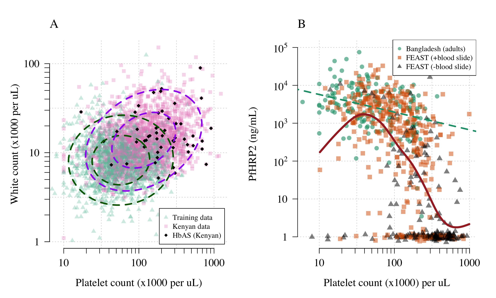
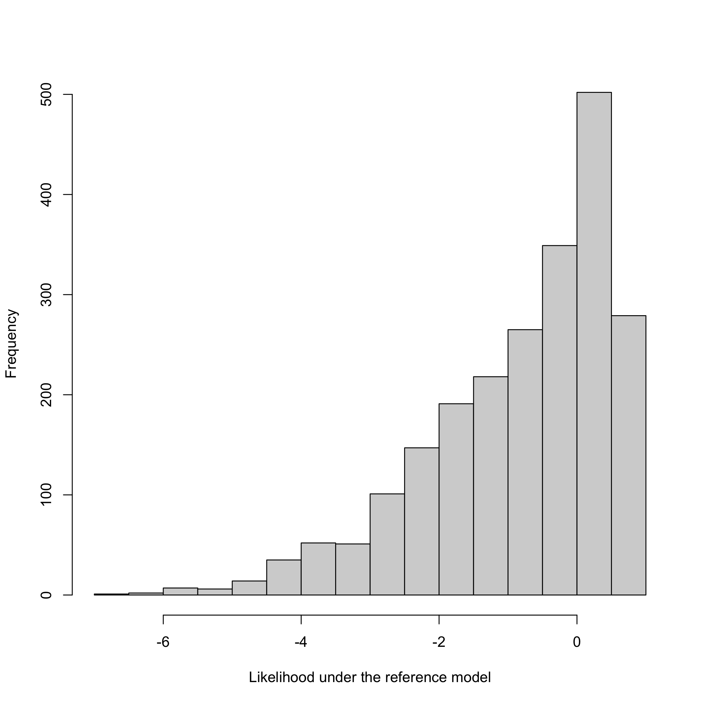
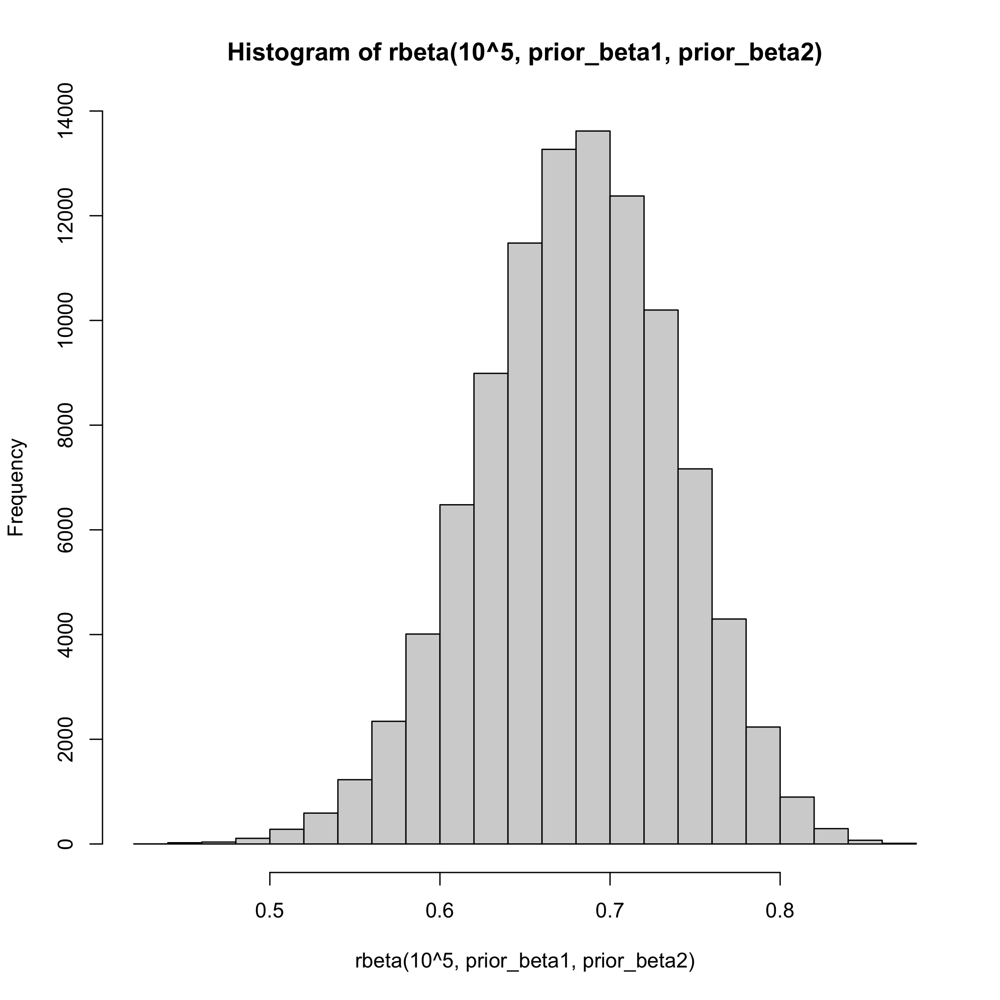
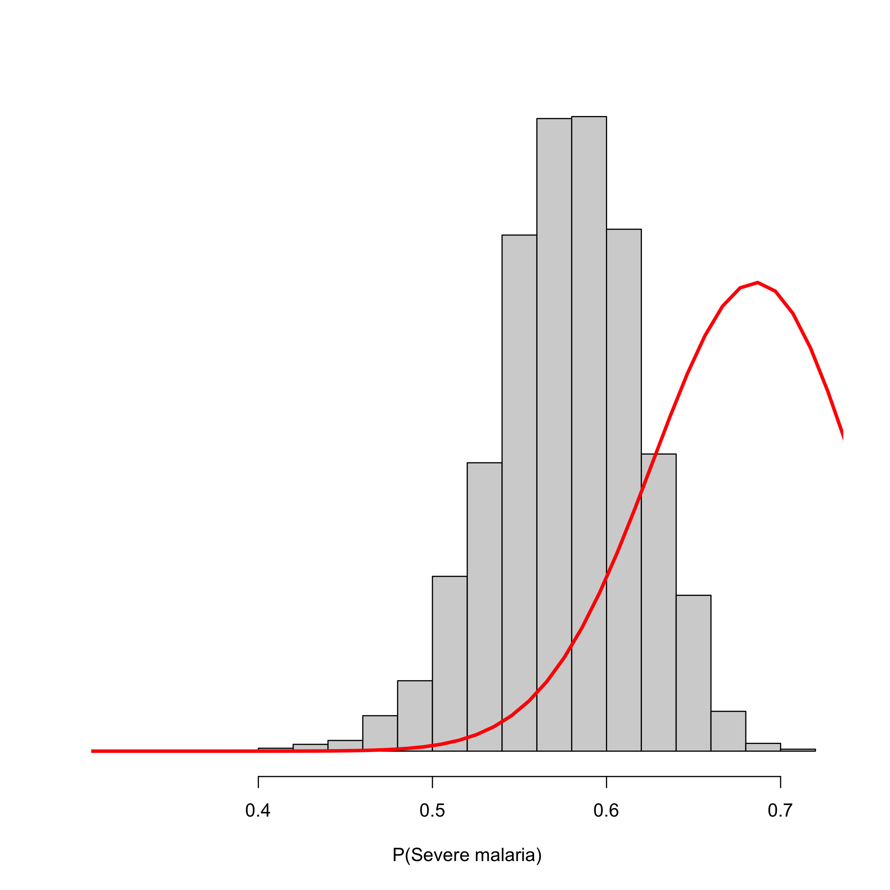

```r
library(gtools)
library(ellipse)
```

```
## 
## Attaching package: 'ellipse'
```

```
## The following object is masked from 'package:graphics':
## 
##     pairs
```

```r
library(rstan)
```

```
## Loading required package: StanHeaders
```

```
## Loading required package: ggplot2
```

```
## rstan (Version 2.21.2, GitRev: 2e1f913d3ca3)
```

```
## For execution on a local, multicore CPU with excess RAM we recommend calling
## options(mc.cores = parallel::detectCores()).
## To avoid recompilation of unchanged Stan programs, we recommend calling
## rstan_options(auto_write = TRUE)
```

```r
library(mclust)
```

```
## Package 'mclust' version 5.4.6
## Type 'citation("mclust")' for citing this R package in publications.
```

```r
library(tictoc)
require(plyr)
```

```
## Loading required package: plyr
```

```r
library(dplyr)
```

```
## 
## Attaching package: 'dplyr'
```

```
## The following objects are masked from 'package:plyr':
## 
##     arrange, count, desc, failwith, id, mutate, rename, summarise,
##     summarize
```

```
## The following objects are masked from 'package:stats':
## 
##     filter, lag
```

```
## The following objects are masked from 'package:base':
## 
##     intersect, setdiff, setequal, union
```

```r
library(rstan)
library(mvtnorm)
```

```
## 
## Attaching package: 'mvtnorm'
```

```
## The following object is masked from 'package:mclust':
## 
##     dmvnorm
```

```r
#library(ks)
#library(weights)
library(mgcv)
```

```
## Loading required package: nlme
```

```
## 
## Attaching package: 'nlme'
```

```
## The following object is masked from 'package:dplyr':
## 
##     collapse
```

```
## This is mgcv 1.8-31. For overview type 'help("mgcv-package")'.
```

```
## 
## Attaching package: 'mgcv'
```

```
## The following object is masked from 'package:mclust':
## 
##     mvn
```

```
## The following object is masked from 'package:gtools':
## 
##     scat
```

```r
library(RColorBrewer)

RUN_STAN = F # if TRUE this runs the model on individual patient probabilities - takes about 10 hours
options(mc.cores = parallel::detectCores()-1)

version
```

```
##                _                           
## platform       x86_64-apple-darwin17.0     
## arch           x86_64                      
## os             darwin17.0                  
## system         x86_64, darwin17.0          
## status                                     
## major          4                           
## minor          0.2                         
## year           2020                        
## month          06                          
## day            22                          
## svn rev        78730                       
## language       R                           
## version.string R version 4.0.2 (2020-06-22)
## nickname       Taking Off Again
```

```r
sessionInfo()
```

```
## R version 4.0.2 (2020-06-22)
## Platform: x86_64-apple-darwin17.0 (64-bit)
## Running under: macOS Catalina 10.15.2
## 
## Matrix products: default
## BLAS:   /Library/Frameworks/R.framework/Versions/4.0/Resources/lib/libRblas.dylib
## LAPACK: /Library/Frameworks/R.framework/Versions/4.0/Resources/lib/libRlapack.dylib
## 
## locale:
## [1] en_US.UTF-8/en_US.UTF-8/en_US.UTF-8/C/en_US.UTF-8/en_US.UTF-8
## 
## attached base packages:
## [1] stats     graphics  grDevices utils     datasets  methods   base     
## 
## other attached packages:
##  [1] RColorBrewer_1.1-2   mgcv_1.8-31          nlme_3.1-148        
##  [4] mvtnorm_1.1-1        dplyr_1.0.0          plyr_1.8.6          
##  [7] tictoc_1.0           mclust_5.4.6         rstan_2.21.2        
## [10] ggplot2_3.3.2        StanHeaders_2.21.0-5 ellipse_0.4.2       
## [13] gtools_3.8.2        
## 
## loaded via a namespace (and not attached):
##  [1] tidyselect_1.1.0   xfun_0.15          purrr_0.3.4        splines_4.0.2     
##  [5] lattice_0.20-41    V8_3.2.0           colorspace_1.4-1   vctrs_0.3.2       
##  [9] generics_0.0.2     htmltools_0.5.0    stats4_4.0.2       loo_2.3.1         
## [13] yaml_2.2.1         rlang_0.4.7        pkgbuild_1.1.0     pillar_1.4.6      
## [17] glue_1.4.1         withr_2.2.0        matrixStats_0.56.0 lifecycle_0.2.0   
## [21] stringr_1.4.0      munsell_0.5.0      gtable_0.3.0       codetools_0.2-16  
## [25] evaluate_0.14      inline_0.3.15      knitr_1.29         callr_3.4.3       
## [29] ps_1.3.3           curl_4.3           parallel_4.0.2     fansi_0.4.1       
## [33] Rcpp_1.0.5.1       scales_1.1.1       RcppParallel_5.0.2 jsonlite_1.7.0    
## [37] gridExtra_2.3      digest_0.6.25      stringi_1.4.6      processx_3.4.3    
## [41] grid_4.0.2         cli_2.0.2          tools_4.0.2        magrittr_1.5      
## [45] tibble_3.0.3       crayon_1.3.4       pkgconfig_2.0.3    Matrix_1.2-18     
## [49] ellipsis_0.3.1     prettyunits_1.1.1  assertthat_0.2.1   rmarkdown_2.3     
## [53] R6_2.4.1           compiler_4.0.2
```

Load curated dataset

```r
load('Inputs/curated_modelling_dataset.RData')
# load imputed datasets
load('Inputs/imputed_Vietam_minimal.RData')
```


## Reference Model P(Data | Severe malaria)


Figure 1

```r
Model_mu = colMeans(dat_Training)
Model_sigma = cov(dat_Training)
print(dim(dat_Training))
```

```
## [1] 1704    2
```

```r
mycols = adjustcolor(RColorBrewer::brewer.pal(name = 'Set2',n = 4),.3)[c(1,4)]
# AQ Vietnam data and Kenyan data overlaid
par(las=1,mfrow=c(1,2),bty='n', family='serif', 
    cex.lab=1.3, cex.axis=1.3, mar = c(5,5,4,2))
axis_titles = c('Platelet count (x1000 per uL)',
                'White count (x1000 per uL)')
axis_points = list(1:3, 0:2)
my_contours = c(0.5, .9)
panels = c('A','B')
dat_kenya$platelets_log10 = log10(dat_kenya$platelet)
dat_kenya$wbc_log10 = log10(dat_kenya$wbc)

plotting_dat = rbind(dat_Training, dat_kenya[,c("platelets_log10",
                                                "wbc_log10") ])
study = c(rep(1, nrow(dat_Training)), rep(2, nrow(dat_kenya)))
ind_rand = sample(1:nrow(plotting_dat), nrow(plotting_dat), replace = F)
plot(plotting_dat[ind_rand,1],plotting_dat[ind_rand,2], 
     main='', xaxt='n',yaxt='n',pch=c(17,15)[study[ind_rand]], 
     panel.first=grid(), xlim = c(.9, 3.1),
     col = mycols[study[ind_rand]], xlab = '',ylab = '')
mtext(text = axis_titles[1], side = 1, line = 3, 
      cex.lab=1.3, cex.axis=1.3,cex = 1.3)
mtext(text = axis_titles[2], side = 2, line = 3,
      las=3, cex.lab=1.3, cex.axis=1.3,cex = 1.3)

points(dat_kenya[dat_kenya$HbAS==1, "platelets_log10"], 
       dat_kenya[dat_kenya$HbAS==1, "wbc_log10"],
       col='black',pch=18)
axis(side = 1, at = axis_points[[1]], 
     labels = 10^axis_points[[1]])
axis(side = 2, at = axis_points[[2]], 
     labels = 10^axis_points[[2]])
axis(side = 1, at = log10(c(seq(10,100,by=10), seq(100,1000,by=100))), 
     tick = T, labels = F)
axis(side = 2, at = log10(c(seq(1,10,by=1), seq(10,100,by=10))), 
     tick = T, labels = F)

for(qq in my_contours){
  lines(ellipse(x = Model_sigma, centre = Model_mu, 
                level = qq), lty=2,lwd=3,col='darkgreen')
  
  lines(ellipse(x = cov(dat_kenya[,c("platelets_log10","wbc_log10")],use = 'comp'), 
                centre = colMeans(dat_kenya[,c("platelets_log10","wbc_log10")],na.rm = T), 
                level = qq), lty=2,lwd=3,col='purple')
}
mtext(text = panels[1], side = 3, line = 1, adj = 0, cex=1.5)
legend('bottomright',inset = 0.02,cex=.9, 
       legend = c('Training data','Kenyan data','HbAS (Kenyan)'),
       col = c(mycols,'black'), pch=c(17,15,18))


############################################################
## ************** Platelets versus PfHRP2 **************
dat_feast_hrp2 = read.csv('Inputs/FEAST_platelets_hrp2.csv')
## Values less than or equal to 1 ng/mL are set to 1ng/mL with random jitter for plotting purposes
dat_feast_hrp2$hrp2[dat_feast_hrp2$hrp2<=1]= 10^rnorm(sum(dat_feast_hrp2$hrp2<=1), 0,0.05)
ind = !is.na(dat_core$hrp2) & dat_core$hrp2>0
mycoefs= coef(MASS::rlm(log10(dat_core$hrp2[ind])~ log10(dat_core$platelets[ind])))

mycols = c(brewer.pal(n = 8, 'Dark2')[c(1,2)], 'black')
plot(log10(dat_core$platelets), 
     log10(dat_core$hrp2), xlim = c(.8, 3),
     panel.first = grid(),
     xlab='Platelet count (x1000) per uL',
     ylab='', xaxt='n', yaxt='n',
     ylim =c(-.1, 5), pch = 16, 
     col=adjustcolor(mycols[1], .6), cex=1.2)
mtext(text = 'PfHRP2 (ng/mL)', side = 2, line = 4, las = 3, cex=1.3)

axis(2, at = 0:5, labels = c(1,10,expression(10^2),expression(10^3),                              expression(10^4),expression(10^5)))
axis(side = 1, at = axis_points[[1]], 
     labels = 10^axis_points[[1]])
axis(side = 1, at = log10(c(seq(10,100,by=10), seq(100,1000,by=100))), 
     tick = T, labels = F)

# make index for blood slide +/-
dat_feast_hrp2$type=2
ind_0parasite = which(!is.na(dat_feast_hrp2$hrp2) & dat_feast_hrp2$parasitaemia==0)
dat_feast_hrp2$type[ind_0parasite] = 3
points(log10(dat_feast_hrp2$platelets),
       log10(dat_feast_hrp2$hrp2),
       pch=c(15,17)[(dat_feast_hrp2$type-1)], 
       col=adjustcolor(mycols[dat_feast_hrp2$type], .5),
       cex=1.2)

ind_spline = !is.na(dat_feast_hrp2$platelets) & dat_feast_hrp2$platelets>10
f=smooth.spline(y = log10(dat_feast_hrp2$hrp2[ind_spline]),
                x = log10(dat_feast_hrp2$platelets[ind_spline]))
lines(f, lwd=4, col='brown',lty=1)
lines(0:10, mycoefs[1]+mycoefs[2]*(0:10), lwd=3,
      col=mycols[1],lty=2)
legend('topright', legend = c('Bangladesh (adults)', 
                              'FEAST (+blood slide)', 
                              'FEAST (-blood slide)'), 
       col = adjustcolor(c(mycols,'black'),.6), pch=c(16,15,17), cex=.9)
mtext(text = 'B', side = 3, line = 1, adj = 0, cex=1.5)
```

<!-- -->

```r
writeLines(sprintf('Training data contains %s individuals', nrow(dat_Training)))
```

```
## Training data contains 1704 individuals
```


Figure for presentation

```r
par(las=1,mfrow=c(1,1),bty='n', family='serif', 
    cex.lab=1.3, cex.axis=1.3, mar = c(5,7,4,2))

plot(log10(dat_core$platelets), 
     log10(dat_core$hrp2), xlim = c(.9, 3),
     xlab='Platelet count (x1000) per uL', ylab='', xaxt='n', yaxt='n',
     ylim =c(-.1, 5), pch = 16, col=mycols[1], cex=1.2)
mtext(text = 'PfHRP2 (ng/mL)', side = 2, line = 4, las = 3, cex=1.3)

axis(2, at = 0:5, labels = 10^(0:5))
axis(side = 1, at = axis_points[[1]], 
     labels = 10^axis_points[[1]])
axis(side = 1, at = log10(c(seq(10,100,by=10), seq(100,1000,by=100))), 
     tick = T, labels = F)


points(log10(dat_feast_hrp2$platelets), log10(dat_feast_hrp2$hrp2),
       pch=c(15,17)[(dat_feast_hrp2$type-1)], 
       col= adjustcolor(mycols[dat_feast_hrp2$type], .6), cex=1.2)

lines(f, lwd=4, col='grey',lty=1)
lines(0:10, mycoefs[1]+mycoefs[2]*(0:10), lwd=4, col=mycols[1],lty=1)
abline(v = log10(200), lty=2)
legend('topright', legend = c('Bangladesh (adults)', 
                              'FEAST (+blood slide)', 
                              'FEAST (-blood slide)'), 
       col = c(mycols), pch=c(16,15,17), cex=.9)
mtext(text = 'B', side = 3, line = 1, adj = 0, cex=1.5)
```

<!-- -->

```r
mycols = adjustcolor(RColorBrewer::brewer.pal(name = 'Set2',n = 4),.6)[c(1,4)]
# AQ Vietnam data and Kenyan data overlaid without classification colors
panels = c('','')

## Just training data
plot(dat_Training[,1],dat_Training[,2], 
     main='', xaxt='n',yaxt='n',pch=17, xlim = c(.9, 3.1),
     panel.first=grid(),
     ylim = range(plotting_dat[,2], na.rm = T),
     col = mycols[1], xlab = '',ylab = '')
mtext(text = axis_titles[1], side = 1, line = 3, 
      cex.lab=1.3, cex.axis=1.3,cex = 1.3)
mtext(text = axis_titles[2], side = 2, line = 3,
      las=3, cex.lab=1.3, cex.axis=1.3,cex = 1.3)

axis(side = 1, at = axis_points[[1]], 
     labels = 10^axis_points[[1]])
axis(side = 2, at = axis_points[[2]], 
     labels = 10^axis_points[[2]])
axis(side = 1, at = log10(c(seq(10,100,by=10), seq(100,1000,by=100))), 
     tick = T, labels = F)
axis(side = 2, at = log10(c(seq(1,10,by=1), seq(10,100,by=10))), 
     tick = T, labels = F)

for(qq in my_contours){
  lines(ellipse(x = Model_sigma, centre = Model_mu, 
                level = qq), lty=2,lwd=3,col='darkgreen')
}
```

<!-- -->

```r
# Training and testing data - imputed and age corrected
mycols = adjustcolor(RColorBrewer::brewer.pal(name = 'Set2',n = 4),.6)[c(1,4)]

plot(plotting_dat[ind_rand,1],plotting_dat[ind_rand,2], 
     main='', xaxt='n',yaxt='n',pch=c(17,15)[study[ind_rand]], 
     panel.first=grid(),xlim = c(.9, 3.1),
     col = mycols[study[ind_rand]], xlab = '',ylab = '')
mtext(text = axis_titles[1], side = 1, line = 3, 
      cex.lab=1.3, cex.axis=1.3,cex = 1.3)
mtext(text = axis_titles[2], side = 2, line = 3,
      las=3, cex.lab=1.3, cex.axis=1.3,cex = 1.3)

# points(dat_kenya$log10_platelet_imputed[dat_kenya$HbAS==1], 
#        dat_kenya$log10_wbc_imputed_corrected[dat_kenya$HbAS==1],
#        col='black',pch=18)
axis(side = 1, at = axis_points[[1]], 
     labels = 10^axis_points[[1]])
axis(side = 2, at = axis_points[[2]], 
     labels = 10^axis_points[[2]])
axis(side = 1, at = log10(c(seq(10,100,by=10), seq(100,1000,by=100))), 
     tick = T, labels = F)
axis(side = 2, at = log10(c(seq(1,10,by=1), seq(10,100,by=10))), 
     tick = T, labels = F)

for(qq in my_contours){
  lines(ellipse(x = Model_sigma, centre = Model_mu, 
                level = qq), lty=2,lwd=3,col='darkgreen')
  
  lines(ellipse(x = cov(dat_kenya[,c('log10_platelet_imputed',
                                     'log10_wbc_imputed_corrected')]), 
                centre = colMeans(dat_kenya[,c('log10_platelet_imputed',
                                               'log10_wbc_imputed_corrected')]), 
                level = qq), lty=2,lwd=3,col='purple')
}
legend('bottomright',inset = 0.02,cex=1.1, 
       legend = c('Training data','Kenyan data'),
       col = c(mycols), pch=c(17,15))
```

<!-- -->

```r
par(mfrow=c(1,1),las=1)
dat_feast_hrp2$SM = as.numeric(dat_feast_hrp2$hrp2>=1000)
mod = mgcv::gam(SM ~ s(log(platelets)), family='binomial', data=dat_feast_hrp2)
summary(mod)
```

```
## 
## Family: binomial 
## Link function: logit 
## 
## Formula:
## SM ~ s(log(platelets))
## 
## Parametric coefficients:
##             Estimate Std. Error z value Pr(>|z|)    
## (Intercept)  -1.1273     0.1473  -7.652 1.99e-14 ***
## ---
## Signif. codes:  0 '***' 0.001 '**' 0.01 '*' 0.05 '.' 0.1 ' ' 1
## 
## Approximate significance of smooth terms:
##                     edf Ref.df Chi.sq p-value    
## s(log(platelets)) 3.603  4.503  141.6  <2e-16 ***
## ---
## Signif. codes:  0 '***' 0.001 '**' 0.01 '*' 0.05 '.' 0.1 ' ' 1
## 
## R-sq.(adj) =  0.369   Deviance explained =   32%
## UBRE = -0.11596  Scale est. = 1         n = 567
```

```r
xs = seq(1,3, length.out = 1000)
ys=predict(mod, newdata = data.frame(platelets=10^xs), se.fit = T)
uppers = inv.logit(ys$fit + 1.96*ys$se.fit)
lowers = inv.logit(ys$fit - 1.96*ys$se.fit)
plot(xs, inv.logit(ys$fit), ylim = c(0,1),
     main = 'Severely ill African children (FEAST)',
     type='l', ylab='Probability PfHRP2>1000 ng/mL', 
     panel.first=grid(),
     xlab='Platelet count', xaxt='n')
axis(side = 1, at = axis_points[[1]], 
     labels = 10^axis_points[[1]])
axis(side = 1, at = log10(c(seq(10,100,by=10), seq(100,1000,by=100))), 
     tick = T, labels = F)
polygon(c(xs, rev(xs)), c(uppers, rev(lowers)), border = NA, col = adjustcolor('grey', .2))
```

<!-- -->

```r
dat_feast_hrp2$parasites = as.numeric(dat_feast_hrp2$parasitaemia>=10000)
mod = mgcv::gam(parasites ~ s(log(platelets)), 
                family='binomial', data=dat_feast_hrp2)
summary(mod)
```

```
## 
## Family: binomial 
## Link function: logit 
## 
## Formula:
## parasites ~ s(log(platelets))
## 
## Parametric coefficients:
##             Estimate Std. Error z value Pr(>|z|)    
## (Intercept)  -0.6246     0.1281  -4.877 1.08e-06 ***
## ---
## Signif. codes:  0 '***' 0.001 '**' 0.01 '*' 0.05 '.' 0.1 ' ' 1
## 
## Approximate significance of smooth terms:
##                     edf Ref.df Chi.sq  p-value    
## s(log(platelets)) 3.952  4.916  79.72 1.06e-15 ***
## ---
## Signif. codes:  0 '***' 0.001 '**' 0.01 '*' 0.05 '.' 0.1 ' ' 1
## 
## R-sq.(adj) =  0.237   Deviance explained = 20.3%
## UBRE = 0.093997  Scale est. = 1         n = 433
```

```r
xs = seq(1,3, length.out = 1000)
ys=predict(mod, newdata = data.frame(platelets=10^xs), se.fit = T)
uppers = inv.logit(ys$fit + 1.96*ys$se.fit)
lowers = inv.logit(ys$fit - 1.96*ys$se.fit)
plot(xs, inv.logit(ys$fit), ylim = c(0,1),
     main = 'Severely ill african children (FEAST)',
     type='l', ylab='Probability >10,000 parasites/uL', panel.first=grid(),
     xlab='Platelet count', xaxt='n')
axis(side = 1, at = axis_points[[1]], 
     labels = 10^axis_points[[1]])
axis(side = 1, at = log10(c(seq(10,100,by=10), seq(100,1000,by=100))), 
     tick = T, labels = F)
polygon(c(xs, rev(xs)), c(uppers, rev(lowers)), border = NA, col = adjustcolor('grey', .2))
```

<!-- -->


## Estimating P(Severe malaria) in the Kenyan cohort

Full model

```r
biomarker_vars = c('log10_platelet_imputed',
                   'log10_wbc_imputed_corrected')
contamination_model = stan_model(file = 'contamination_model.stan')
dat_kenya$Ref_Model_Likelihood = dmvt(x = dat_kenya[, biomarker_vars], 
                                      delta = Model_mu, 
                                      sigma = Model_sigma, 
                                      df = 7)
hist(dat_kenya$Ref_Model_Likelihood, 
     xlab='Likelihood under the reference model',main='')
```

<!-- -->

```r
threshold_100_percent = quantile(dat_kenya$Ref_Model_Likelihood,probs=0.8)

ind = !is.na(dat_kenya$HbAS)

# make a sub data set with available HbAS - which we sort by Likelihood value
kemri_sickle_data = data.frame(sickle_trait=dat_kenya$HbAS[ind],
                               lik = dat_kenya$Ref_Model_Likelihood[ind])
kemri_sickle_data = kemri_sickle_data[order(kemri_sickle_data$lik), ]
N = nrow(kemri_sickle_data)

# in the top quintile
N2 = sum(kemri_sickle_data$lik>threshold_100_percent)
print(N2)
```

```
## [1] 443
```

```r
N2_sickle = sum(kemri_sickle_data$sickle_trait[(N-N2+1):N])
print(N2_sickle)
```

```
## [1] 6
```

```r
Nunknown = N-N2
print(Nunknown)
```

```
## [1] 1770
```

```r
Nunknown_sickle = sum(kemri_sickle_data$sickle_trait[1:(N-N2)])
print(Nunknown_sickle)
```

```
## [1] 51
```

```r
# Run Bayesian mode
out_mod=sampling(object = contamination_model, 
                 data = list(Nunknown = Nunknown, 
                             Nunknown_sickle = Nunknown_sickle, 
                             N1 = 6748,
                             N1_sickle = 364,
                             N2 = N2,
                             N2_sickle = N2_sickle,
                             b1 = 5, b2=95, a1=1, a2=99), iter=10^5)
thetas_contam = extract(out_mod)
print(quantile(1-thetas_contam$q, probs = c(0.025, .5, .975)))
```

```
##      2.5%       50%     97.5% 
## 0.3687138 0.6037077 0.8871704
```

```r
print(100*mean(thetas_contam$p1))
```

```
## [1] 5.369509
```

```r
print(100*mean(thetas_contam$p2))
```

```
## [1] 1.33503
```

```r
P_SM_main = 1-mean(thetas_contam$q) * (N-N2) / N

est_SM = 1-(quantile(thetas_contam$q * (N-N2), 
                     probs = rev(c(0.025, .1, .5, .9, .975)))/N)
est_SM = round(100*est_SM)
writeLines(sprintf('The proportion of individuals in the dataset with severe malaria is %s%% (95%% credible interval %s-%s)',
                   est_SM[3], est_SM[1], est_SM[5]))
```

```
## The proportion of individuals in the dataset with severe malaria is 68% (95% credible interval 50-91)
```


## Estimating individual probabilities P(Severe malaria | Data)


Priors

```r
source('stan_mixture_model_student2.R')

mu_priorSM = c(1.8, .95)
mu_prior_notSM = c(2.5, 1.5)
sd_prior_notSM = c(.25, .25)
sd_priorSM = c(0.1, 0.1)
prior_beta1 = .65*est_SM[3]
prior_beta2 = .65*(100-est_SM[3])

hist(rbeta(10^5, prior_beta1, prior_beta2))
```

<!-- -->


Penalised max-likelihood

```r
Testing_data = dat_kenya[, biomarker_vars] # age-corrected wbc

k_imputed_dataset = 1
stan_data = list(D=2,
                 K_notSM=6,
                 N_Training_Africa = nrow(dat_feast_training),
                 N_Training_Asia = nrow(imputed_Vietam_minimal[[k_imputed_dataset]])+
                   nrow(dat_core),
                 N_Testing = nrow(Testing_data),
                 y_Training_Africa = dat_feast_training[,c("platelets_log10",
                                                           "wbc_log10_corrected")],
                 y_Training_Asia = rbind(imputed_Vietam_minimal[[1]][, c("platelets_log10",
                                                                         "wbc_log10")],
                                         dplyr::rename(dat_core[, c("platelets_log10",
                                                      "log10_wbc_corrected")],
                                                wbc_log10=log10_wbc_corrected)),
                 y_Testing = Testing_data,
                 mu_priorSM = mu_priorSM,
                 mu_prior_notSM = mu_prior_notSM,
                 sd_prior_notSM = sd_prior_notSM,
                 sd_priorSM = sd_priorSM,
                 prior_beta1 = prior_beta1,
                 prior_beta2 = prior_beta2)

out_mod_student_ML=
  optimizing(object = mix_model_student2, data = stan_data, seed = 6987)

round(out_mod_student_ML$par[grep('theta', names(out_mod_student_ML$par))],2)
```

```
##       theta_SM  theta_SMstudy theta_notSM[1] theta_notSM[2] theta_notSM[3] 
##           0.58           0.03           0.46           0.01           0.49 
## theta_notSM[4] theta_notSM[5] theta_notSM[6] 
##           0.00           0.01           0.03
```

```r
round(10^out_mod_student_ML$par[grep('mu_', names(out_mod_student_ML$par))],1)
```

```
##         mu_SM[1]         mu_SM[2] mu_SM_study[1,1] mu_SM_study[2,1] 
##             68.2              8.5             57.7             81.7 
## mu_SM_study[1,2] mu_SM_study[2,2]    mu_notSM[1,1]    mu_notSM[2,1] 
##              8.2              8.8            266.8            220.7 
##    mu_notSM[3,1]    mu_notSM[4,1]    mu_notSM[5,1]    mu_notSM[6,1] 
##            126.7            181.6            436.8            100.3 
##    mu_notSM[1,2]    mu_notSM[2,2]    mu_notSM[3,2]    mu_notSM[4,2] 
##             11.4             29.7             20.4             40.9 
##    mu_notSM[5,2]    mu_notSM[6,2] 
##             31.8             24.2
```

```r
round(10^out_mod_student_ML$par[grep('mu', names(out_mod_student_ML$par))])
```

```
##         mu_SM[1]         mu_SM[2] mu_SM_study[1,1] mu_SM_study[2,1] 
##               68                9               58               82 
## mu_SM_study[1,2] mu_SM_study[2,2]    mu_notSM[1,1]    mu_notSM[2,1] 
##                8                9              267              221 
##    mu_notSM[3,1]    mu_notSM[4,1]    mu_notSM[5,1]    mu_notSM[6,1] 
##              127              182              437              100 
##    mu_notSM[1,2]    mu_notSM[2,2]    mu_notSM[3,2]    mu_notSM[4,2] 
##               11               30               20               41 
##    mu_notSM[5,2]    mu_notSM[6,2]          sd_muSM 
##               32               24                1
```

```r
ps1=out_mod_student_ML$par[grep('prob_SM', names(out_mod_student_ML$par))]
hist(ps1)
```

<!-- -->


Full Bayes

```r
# Takes about 9 hours to run the sampler
if(RUN_STAN){
  out_mod_student=sampling(object = mix_model_student2, 
                           data = stan_data, 
                           seed=29864826, chains=7)
  
  save(out_mod_student, file = 'Outputs/mixture_model_out.RData')
} else {
  load(file = 'Outputs/mixture_model_out.RData')
}
my_thetas = extract(out_mod_student)
traceplot(out_mod_student, pars=c('mu_SM','theta_SM','theta_SMstudy'))
```

<!-- -->

```r
plot(out_mod_student, pars=c('theta_SM', 'theta_SMstudy','theta_notSM'))
```

```
## ci_level: 0.8 (80% intervals)
```

```
## outer_level: 0.95 (95% intervals)
```

<!-- -->

```r
plot(out_mod_student, pars=c('mu_SM','mu_SM_study','mu_notSM'))
```

```
## ci_level: 0.8 (80% intervals)
## outer_level: 0.95 (95% intervals)
```

<!-- -->

```r
hist(my_thetas$theta_SM, freq = F, xlab='P(Severe malaria)', 
     yaxt='n', ylab = '',main='')
lines(seq(0,1,length.out = 100),
      dbeta(seq(0,1,length.out = 100),prior_beta1,prior_beta2),
      lwd=3,col='red')
```

<!-- -->

```r
median(my_thetas$theta_SM)
```

```
## [1] 0.5786242
```

```r
ps_post = apply(my_thetas$prob_SM, 2, mean)
dat_kenya$P_SMs = ps_post
```


## Predictive value of P(Severe malaria | Data)


Fit GAMS to likelihood values (quantiles of) with platelets/wbc/parasitaemia 


```r
par(las=1, bty='n', family='serif', mfrow=c(2,2),
    cex.lab=1.5, cex.axis=1.5)
layout(mat = matrix(c(1,1,1,2,2,2,3,3,4,4,5,5),nrow = 2,byrow = T))

hist(dat_kenya$P_SMs, breaks = 20, ylab = 'Number of patients',
     xlab = 'P(Severe malaria | Data)', main='', xlim=c(0,1))
mtext(text = 'A', side = 3, adj = 0, cex = 1.5)

f=colorRampPalette(colors = RColorBrewer::brewer.pal(name = 'RdYlBu',n = 11))
n_levels = 11
mycuts = cut(x = dat_kenya$P_SMs, breaks = seq(0,1,by=1/n_levels))
cols_ind = as.numeric(mycuts)
mycols = f(n_levels)
plot(log10(dat_kenya$platelet),log10(dat_kenya$wbc),
     xlab='Platelet count (x1000 per uL)', xaxt='n', yaxt='n',
     ylab='White count (x1000 per uL)', pch=16, panel.first=grid(),
     col = adjustcolor(mycols[cols_ind], .7), ylim = c(log10(3),2))
ind_sickle=dat_kenya$HbAS==1
points(log10(dat_kenya$platelet)[ind_sickle],
       log10(dat_kenya$wbc)[ind_sickle], pch=18, cex=1.5)
axis_points = list(1:3, 0:2)
axis(side = 1, at = axis_points[[1]], 
     labels = 10^axis_points[[1]])
axis(side = 2, at = log10(c(3,10,30,100)), 
     labels = c(3,10,30,100))
axis(side = 1, at = log10(c(seq(10,100,by=10),
                            seq(100,1000,by=100))), 
     tick = T, labels = F)
axis(side = 2, at = log10(c(seq(3,10,by=1), seq(10,100,by=10))), 
     tick = T, labels = F)
lgd_ = rep(NA, n_levels)
lgd_[c(1,6,11)] = c(0,0.5,1)
legend('topleft',
       legend = lgd_,
       fill = mycols,bty='n',x.intersp =.5,
       border = NA,inset = 0.01,
       y.intersp = 0.5,title = '',
       cex = 1, text.font = 1)
mtext(text = 'B', side = 3, adj = 0, cex = 1.5)


myx = dat_kenya$P_SMs
xs = seq(min(myx),max(myx),length.out = 100)[-1]

##******** SICKLE ****************
mod = gam(sickle_trait ~ s(x,k=4), family='binomial', 
          data=data.frame(x=myx, 
                          sickle_trait=dat_kenya$HbAS))
summary(mod)
```

```
## 
## Family: binomial 
## Link function: logit 
## 
## Formula:
## sickle_trait ~ s(x, k = 4)
## 
## Parametric coefficients:
##             Estimate Std. Error z value Pr(>|z|)    
## (Intercept)  -3.8356     0.1612  -23.79   <2e-16 ***
## ---
## Signif. codes:  0 '***' 0.001 '**' 0.01 '*' 0.05 '.' 0.1 ' ' 1
## 
## Approximate significance of smooth terms:
##        edf Ref.df Chi.sq  p-value    
## s(x) 1.002  1.004  19.96 8.11e-06 ***
## ---
## Signif. codes:  0 '***' 0.001 '**' 0.01 '*' 0.05 '.' 0.1 ' ' 1
## 
## R-sq.(adj) =  0.00925   Deviance explained = 4.22%
## UBRE = -0.76896  Scale est. = 1         n = 2213
```

```r
preds = predict(mod, se.fit = T, newdata = data.frame(x=xs))
ys = 100*c(inv.logit(preds$fit+1.96*preds$se.fit),
           rev(inv.logit(preds$fit-1.96*preds$se.fit)))
plot(xs, 100*inv.logit(preds$fit),type='l',lwd=3,
     xlim = c(0,1),
     xlab='P(Severe malaria | Data)',
     ylim = range(c(0,ys)), ylab='HbAS (%)')
polygon(c(xs, rev(xs)), ys,panel.first=grid(),
        border = NA, col = adjustcolor('grey',.3))
mtext(text = 'C', side = 3, adj = 0, cex = 1.5)
abline(h = 100*mean(dat_kenya$HbAS,na.rm = T),lty=2, lwd=2)


writeLines('##******** DEATH ****************')
```

```
## ##******** DEATH ****************
```

```r
mod = gam(died ~ s(x,k=4), family='binomial', 
          data=data.frame(x=myx, 
                          died=dat_kenya$died))
summary(mod)
```

```
## 
## Family: binomial 
## Link function: logit 
## 
## Formula:
## died ~ s(x, k = 4)
## 
## Parametric coefficients:
##             Estimate Std. Error z value Pr(>|z|)    
## (Intercept) -2.10500    0.07083  -29.72   <2e-16 ***
## ---
## Signif. codes:  0 '***' 0.001 '**' 0.01 '*' 0.05 '.' 0.1 ' ' 1
## 
## Approximate significance of smooth terms:
##        edf Ref.df Chi.sq  p-value    
## s(x) 2.517  2.827  44.93 1.05e-09 ***
## ---
## Signif. codes:  0 '***' 0.001 '**' 0.01 '*' 0.05 '.' 0.1 ' ' 1
## 
## R-sq.(adj) =  0.0216   Deviance explained = 2.95%
## UBRE = -0.30028  Scale est. = 1         n = 2207
```

```r
not_na_died = !is.na(dat_kenya$died)
preds = predict(mod, se.fit = T, newdata = data.frame(x=xs))
ys = 100*c(inv.logit(preds$fit+
                       1.96*preds$se.fit),
           rev(inv.logit(preds$fit-
                           1.96*preds$se.fit)))
plot(xs,100*inv.logit(preds$fit),type='l',lwd=3,
     xlim = c(0,1), ylim = range(c(0,ys)),
     xlab='P(Severe malaria | Data)',
     ylab='Mortality (%)')
polygon(c(xs, rev(xs)),ys,panel.first=grid(),
        border = NA, col = adjustcolor('grey',.3))
mtext(text = 'D', side = 3, adj = 0, cex = 1.5)
abline(h = 100*mean(dat_kenya$died, na.rm = T),
       lty=2, lwd=2)

writeLines('##******** PARASITE DENSITY ****************')
```

```
## ##******** PARASITE DENSITY ****************
```

```r
plot(dat_kenya$P_SMs, dat_kenya$log_parasites, pch=16, 
     col = adjustcolor('grey', .4), xlim = c(0,1),
     ylim = c(1.8, 6.3),
     xlab='P(Severe malaria | Data)',
     panel.first = grid(),yaxt='n',
     ylab='Parasite density (per uL)')
axis(2, at = 2:6, labels = c(expression(10^2),expression(10^3),                              expression(10^4),expression(10^5),expression(10^6)))
mod = gam(log_parasites ~ s(P_SMs,k=4), data=dat_kenya)
preds = predict(mod, se.fit = T, 
                newdata = data.frame(P_SMs=xs))
ys = c(preds$fit+1.96*preds$se.fit,
       rev(preds$fit - 1.96*preds$se.fit))
polygon(c(xs, rev(xs)),ys, 
        border = NA, col = adjustcolor('grey',.6))
lines(xs, preds$fit,lwd=3)
mtext(text = 'E', side = 3, adj = 0, cex = 1.5)
abline(h = mean(dat_kenya$log_parasites, na.rm = T),
       lty=2, lwd=2)
```

<!-- -->

```r
summary(mod)$s.pv
```

```
## [1] 1.447634e-23
```


Summarise the top and bottom 20th percentiles

```r
upper_p = round(quantile(dat_kenya$P_SMs, probs=.8),3)
print(upper_p)
```

```
##   80% 
## 0.924
```

```r
lower_p = round(quantile(dat_kenya$P_SMs, probs=.2),3)
print(lower_p)
```

```
##   20% 
## 0.183
```

```r
top_ind = dat_kenya$P_SMs>upper_p
bottom_ind = dat_kenya$P_SMs<lower_p

sum(top_ind)
```

```
## [1] 446
```

```r
sum(bottom_ind)
```

```
## [1] 444
```

```r
sum(dat_kenya$HbAS[top_ind],na.rm = T)
```

```
## [1] 3
```

```r
sum(dat_kenya$HbAS[bottom_ind],na.rm = T)
```

```
## [1] 21
```

```r
writeLines(sprintf('For patients with P(SM|Data)>%s, %s%% have sickle trait versus %s%% for patients with P(SM|Data)< %s',
                   upper_p,
                   round(100*mean(dat_kenya$HbAS[top_ind],na.rm = T),1),
                   round(100*mean(dat_kenya$HbAS[bottom_ind],na.rm = T),1),
                   lower_p))
```

```
## For patients with P(SM|Data)>0.924, 0.7% have sickle trait versus 4.8% for patients with P(SM|Data)< 0.183
```

```r
writeLines(sprintf('For patients with P(SM|Data)>%s, %s%% died versus %s%% for patients with P(SM|Data)< %s',
                   upper_p,
                   round(100*mean(dat_kenya$died[top_ind],na.rm = T),1),
                   round(100*mean(dat_kenya$died[bottom_ind],na.rm = T),1),
                   lower_p))
```

```
## For patients with P(SM|Data)>0.924, 6.1% died versus 18.8% for patients with P(SM|Data)< 0.183
```


Save output

```r
ws_dat = data.frame(ws = ps_post)
save(ws_dat, file = 'Outputs/patient_SM_weights.RData')
save(dat_kenya, file = 'Outputs/Kenya_dat_PSM.RData')
```


